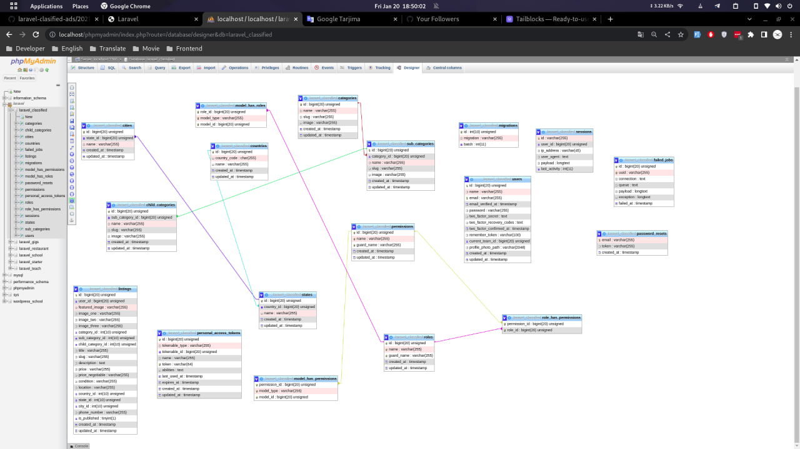
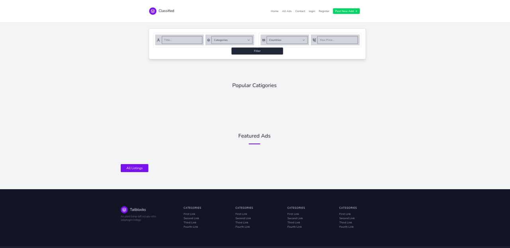
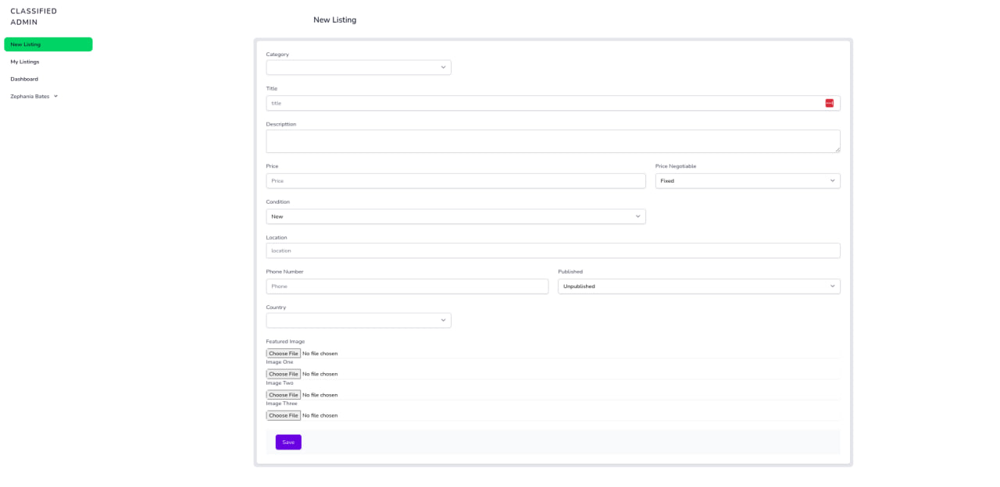

<p align="center"><a href="https://laravel.com" target="_blank"></a></p>

<h1>Laravel Classified</h1>

     


<hr><p>This project is for starter developers from laravel 8, a video tutorial form Laraveller</p><h2>Technologies Used</h2>
<hr><ul>
<li>HTML</li>
</ul><ul>
<li>CSS</li>
</ul><ul>
<li>JavaScript</li>
</ul><ul>
<li>PHP</li>
</ul><ul>
<li>Laravel</li>
</ul><h2>Features</h2>
<hr><ul>
<li>You can classify ads.</li>
</ul><h2>Screenshots</h2>
<hr><p></p><p></p><p></p><h2>Setup</h2>
<hr><p>To run the project you need a server and PHP and MySQL installed on it.</p><ul>

## Guide of Install Porject


``` 
cp .env.example .env
```
``` 
composer install 
```
``` 
npm install 
```
``` 
php artisan key:generate
```
``` 
php artisan migrate:fresh -seed
```
``` 
php artisan sortage:link
```
``` 
npm run dev
```
</ul><h2>Contact</h2>
<hr><p><span style="margin-right: 30px;"></span><a href="http://www.linkedin.com/in/samandar-abdullayev-9b13891b7"></a><span style="margin-right: 30px;"></span><a href="https://github.com/xkas01"></a><span style="margin-right: 30px;"></span><a href="https://facebook.com/abdullayev.samandar.01"></a></p>
